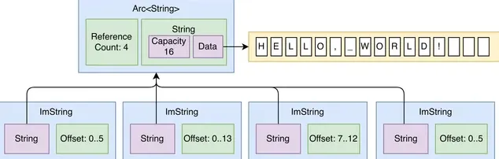

# Working with Strings in Rust: A Definitive Guide
  
[Working with Strings in Rust: A Definitive Guide | by Luis Soares | Dev Genius](https://blog.devgenius.io/working-with-strings-in-rust-a-definitive-guide-b688931f295c)



Rust’s approach to strings can be a bit challenging for newcomers to the language or developers familiar with strings in other languages. This article aims to shed light on string handling in Rust, complete with detailed examples.

## Two Types of Strings

Rust offers two primary string types:

### 1. `String` Type

- **Nature**: `String` in Rust represents a growable, heap-allocated string. It is analogous to `std::string` in C++ or `StringBuilder` in Java.
- **Flexibility and Mutability**: Being dynamically allocated, `String` allows you to modify, append, and perform various operations on the content after its initial declaration.
- **Ownership**: One of Rust’s core principles is its ownership system, which ensures memory safety without the need for a garbage collector. When a `String` is passed to a function or assigned to another variable, its ownership is transferred unless a reference or clone is used. This avoids dangling references and ensures clear memory management semantics.

**Example**:
```rust
let mut dynamic_string = String::from("Hello");
dynamic_string.push_str(", Rust!");
println!("{}", dynamic_string);// Outputs: "Hello, Rust!"
```

### 2. `str` Type

- **Nature**: `str` is an immutable sequence of UTF-8 characters. In practice, you'll often encounter it as a borrowed reference: `&str`. This is similar to a string slice or view in other languages.
- **Efficiency**: `&str` is lightweight, making it an efficient way to provide a read-only view into string data without transferring ownership or duplicating the underlying data.
- **Static and Dynamic**: While `&str` can refer to statically-defined string literals, it can also be a slice/view into a heap-allocated `String`.

**Example**:

```rust
let static_str: &str = "Hello, Rust!";
let part_of_string = &dynamic_string\[0..5\];// Slicing a String into a &str
```

## Working with Strings

### Creating Strings

```rust
// Using the String type:
let mut dynamic_string = String::from("Hello, Rust!");

// Using the &str type:
let static_str: &str = "Hello, Rust!";
```

### Modifying Strings

With the `String` type, you can easily modify the string.

```rust
let mut greeting = String::from("Hello");
greeting.push(' ');// Push a character.
greeting.push_str("World!");// Push a string slice.
println!("{}", greeting);// Outputs: "Hello World!"
```

### Accessing String Contents

Strings in Rust are UTF-8 encoded by default. This means direct indexing like `greeting[0]` doesn't work, because a single character might span more than one byte.

However, you can iterate over the characters:

```rust
for ch in "नमस्ते".chars() {
    println!("{}", ch);
}
```

To get a specific character by index, convert the string to a vector of characters:

```rust
let chars: Vec = "नमस्ते".chars().collect();
println!("{}", chars\[0\]);// Outputs: "न"
```

### String Slicing

You can obtain a substring using slicing.

```rust
let phrase = "Rust is fun!";
let part = &phrase\[0..4\];// "Rust"
```

Ensure your slices are on valid UTF-8 boundaries, or you’ll get a panic.

### String Concatenation

Combining strings or string slices can be done in a couple of ways:

#### `+` Operator:
Using the `+` Operator: This consumes the first string.

`let hello = String::from("Hello, "); let world = "World!"; let combined = hello + world;`

#### `format!` Macro:
Using the `format!` Macro: This does not consume any of the strings.

`let combined = format!("{}{}", hello, world);`

### Checking String Contents

Rust provides many useful methods to check string content:

```rust
let content = "Rustacean";

assert!(content.contains("Rust"));
assert!(content.starts_with("Rust"));
assert!(content.ends_with("cean"));
```

### Converting Between Strings and Other Types

Rust allows easy conversion between strings and other types using the `parse` and `to_string` methods.

```rust
// Convert string to a number:
let num_str = "42";
let number: i32 = num_str.parse().expect("Not a valid number");

// Convert number to a string:
let n = 42;
let converted_str = n.to_string();
assert_eq!(num_str, converted_str);
```

### Handling Errors

String methods in Rust often return a `Result` type, allowing for robust error handling.

```rust
match "42".parse::() {
    Ok(val) =println!("Parsed value: {}", val),
    Err(err) =println!("Failed to parse: {}", err),
}
```

### String Capacity and Length

In Rust, strings have both capacity and length attributes. The `capacity` refers to the total space allocated for the string, while `length` indicates the actual length of the string content.

```rust
let mut s = String::with_capacity(10);
s.push_str("Rust");

println!("Content: {}", s);
println!("Length: {}", s.len());// Outputs: "4"
println!("Capacity: {}", s.capacity());// Outputs: "10"
```

### String Trimming

Often, you might want to remove leading and trailing white spaces:

```rust
let padded = " Rust is awesome! ";
let trimmed = padded.trim();

println!("Original: '{}'", padded); // Outputs: " Rust is awesome! "
println!("Trimmed: '{}'", trimmed); // Outputs: "Rust is awesome!"
```

### Byte-wise Representation

Given the UTF-8 nature of Rust strings, it might sometimes be necessary to work with the byte-wise representation:

```rust
let content = "Rust";
for byte in content.as_bytes() {
    println!("{}", byte);
}
```

### String Replacement

Rust’s string methods provide simple ways to replace content:

```rust
let original = "I like C++. I use C++.";
let replaced = original.replace("C++", "Rust");

println!("Replaced: {}", replaced); // Outputs: "I like Rust. I use Rust."
```

## What about the char Type in Rust?

In Rust, the `char` type represents a single Unicode scalar value, which means it can represent any character in the Unicode standard, not just ASCII. This differs from other languages where a character might only represent a single byte.

## Size and Representation

- A `char` in Rust always takes up 4 bytes (32 bits) of memory, regardless of its specific value. This is because it's representing Unicode scalar values, which range from `U+0000` to `U+D7FF` and `U+E000` to `U+10FFFF`.
- As a result, a `char` can represent a vast array of characters, including Latin letters and numerals, Greek characters, Cyrillic, emoji, ancient symbols, and much more.

## Declaration and Initialization

Declaring and initializing a `char` is straightforward:

```rust
let latin_char: char = 'a';
let cyrillic_char: char = 'я';
let emoji: char = '😀';
```

Note the single quotes (`'`). This distinguishes a `char` value from a string (`&str`) which uses double quotes (`"`).

## Character Operations

Several methods are available to work with the `char` type. For instance:

**Case Conversion**:

`let upper = 'a'.to_uppercase().next().unwrap(); let lower = 'A'.to_lowercase().next().unwrap();`

**Numeric Operations**:

`if '9'.is_numeric() { println!("It's a number!"); }`

**Alphabetic Checks**:

`if 'a'.is_alphabetic() { println!("It's alphabetic!"); }`

### Escaping Characters

Special characters can be represented using escape sequences:

```rust
let newline = '\n';
let tab = '\t';
let single_quote = '\'';
let double_quote = '\"';
```

## Key Differences Summarized:

### Storage:

- `String`: Heap-allocated, growable.
- `str`: A view/slice into a string can be either statically or dynamically allocated.`char`: Single Unicode character, 4 bytes.

### Mutability:

`String`: Mutable.`str`: Immutable.`char`: Immutable.

### Use Case:

- `String`: When you need to modify or construct strings at runtime.
- `str`: When you want to view or borrow part of a string without ownership.
- `char`: When working with individual characters.

**Check out more articles about Rust in my** [**Rust Programming Library**](https://medium.com/@luishrsoares/list/mastering-rust-programming-06763d788b6e)!

## Conclusion:

While Rust’s approach to strings might initially seem challenging, this granularity provides an immense advantage in flexibility, safety, and performance optimization. By understanding the distinctions and applications of `String`, `str`, and `char`, developers can write more efficient and safer Rust programs.

Whether constructing dynamic strings, borrowing string data without taking ownership, or manipulating individual characters, Rust offers precise tools tailored for each job, exemplifying the language’s dedication to safety and performance.